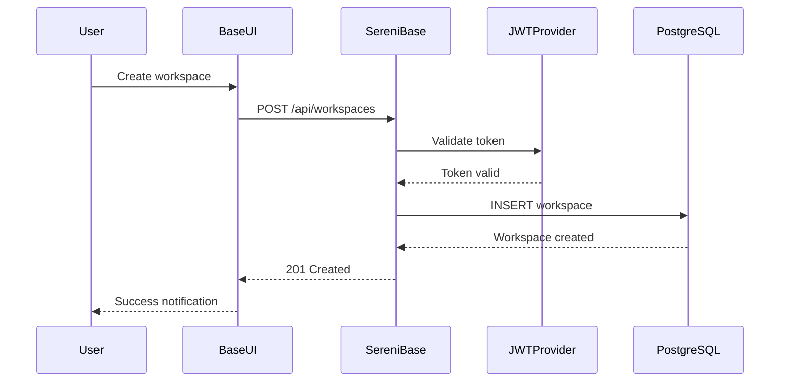

# Sereni Ecosystem Architecture

> **Complete Architecture Guide**: For a comprehensive overview of the entire Sereni ecosystem, see the [detailed architecture documentation](../docs/architecture.md).

## Quick Architecture Overview

Sereni is built as a modular microservices ecosystem with the following components:

```
┌─────────────┐    ┌─────────────┐    ┌─────────────┐
│   Base UI   │    │  Admin UI   │    │  Mobile App │
│ (React/TS)  │    │ (React/TS)  │    │(React/TS)   │
│   :5050     │    │   :3000     │    │   :3001     │
└─────────────┘    └─────────────┘    └─────────────┘
       │                   │                   │
       └─────────────┬─────────────┬───────────┘
                     │             │
              ┌─────────────────────────────┐
              │     Load Balancer          │
              │    (Nginx/HAProxy)         │
              └─────────────────────────────┘
                           │
              ┌─────────────────────────────┐
              │      Sereni Base           │
              │    (Core REST API)          │
              │       Port: 8080           │
              └─────────────────────────────┘
                           │
    ┌──────────────┬───────┼────────┬──────────────┐
    │              │       │        │              │
┌───▼───┐  ┌───▼───┐  ┌───▼───┐  ┌──▼──┐  ┌──▼───────┐
│JWT    │  │Email  │  │Storage│  │Anti │  │PostgreSQL│
│:8081  │  │:8082  │  │:8083  │  │:8084│  │:5432     │
└───────┘  └───────┘  └───────┘  └─────┘  └──────────┘
```

## Core Components

| Component | Repository | Port | Language | Purpose |
|-----------|------------|------|----------|---------|
| **Sereni Base** | `sereni-base` | 8080 | Go | Core API server, workspace management |
| **Base UI** | `base-ui` | 5050 | React/TS | Primary user interface |
| **Base SDK** | `base-sdk` | - | TypeScript | Official API client library |
| **JWT Provider** | `sereni-jwt-provider` | 8081 | Go | Authentication service |
| **Email Service** | `sereni-email-smtp` | 8082 | Go | Email delivery service |
| **Storage Provider** | `sereni-storage-provider` | 8083 | Go | File storage service |
| **Antivirus Service** | `sereni-antivirus-clamav` | 8084 | Go | File security scanning |
| **PostgreSQL REST** | `go-postgres-rest` | 8080 | Go | High-performance database API |

## Provider Architecture

All services follow the **Provider Pattern** for maximum flexibility:

```go
// Generic provider interface
type Provider interface {
    Initialize(config Config) error
    Execute(params ExecuteParams) error  
    Validate() error
    Cleanup() error
}
```

This allows easy swapping of implementations:
- **JWT**: HS256, RS256, ES256 algorithms
- **Email**: Gmail, SendGrid, Mailgun, custom SMTP
- **Storage**: MinIO, AWS S3, Google Cloud, Azure
- **Database**: PostgreSQL, MySQL (planned), MongoDB (planned)

## Key Features

### 🏗️ Microservices Architecture
- Independent development and deployment
- Language flexibility (Go backend, React/TS frontend)
- Horizontal scaling capability

### 🛡️ Security First
- JWT-based authentication
- Multi-tenant data isolation
- Role-based access control (RBAC)
- Audit logging
- Input validation and sanitization

### ⚡ High Performance
- Connection pooling
- Efficient database queries
- Caching strategies
- Async processing

### 🌍 Multi-Tenant
- Complete workspace isolation
- Organization-level management
- Scalable tenant architecture

### 🔧 Developer Friendly
- Comprehensive APIs
- TypeScript SDK
- Docker containerization
- Extensive documentation

## Data Flow Example



## Quick Start

### Prerequisites
- Docker & Docker Compose
- Go 1.21+ (for development)
- Node.js 18+ (for frontend development)

### Start All Services
```bash
# Clone main repository
git clone https://github.com/aptlogica/sereni-base.git
cd sereni-base

# Start all services
make setup
make up

# Access points
# Frontend:  http://localhost:5050
# API:       http://localhost:8080  
# API Docs:  http://localhost:8080/swagger/index.html
```

### Development Mode
```bash
# Start infrastructure
make db-docker

# Start individual services
cd sereni-base && make dev        # Core API
cd base-ui && npm run dev         # Frontend
cd sereni-jwt-provider && make dev # JWT service
```

## Service Dependencies

```
sereni-base
├── Depends on: postgresql, jwt-provider
├── Optional: email-smtp, storage-provider, antivirus
│
base-ui  
├── Depends on: sereni-base
├── Uses: base-sdk
│
Providers (jwt, email, storage, antivirus)
├── Independent services
├── Called by: sereni-base
```

## Environment Configuration

Key environment variables across services:

```bash
# Database
DB_HOST=localhost
DB_PORT=5432
DB_USER=postgres
DB_NAME=sereni

# JWT
JWT_SECRET=your-secret-key
JWT_EXPIRY=24h

# Email  
SMTP_HOST=smtp.gmail.com
SMTP_PORT=587
SMTP_USERNAME=your-email
SMTP_PASSWORD=your-app-password

# Storage
STORAGE_PROVIDER=minio
MINIO_ENDPOINT=localhost:9000
```

## Deployment

### Docker Compose (Recommended)
```bash
docker-compose -f docker-compose.production.yml up -d
```

### Kubernetes (Enterprise)
```bash
kubectl apply -f k8s/
```

### Individual Services
```bash
# Build and run each service independently
docker build -t sereni-base:latest .
docker run -p 8080:8080 sereni-base:latest
```

## Monitoring and Health

### Health Endpoints
- Core API: `GET /health`
- JWT Provider: `GET /health`  
- Email Service: `GET /health`

### Metrics
- Prometheus metrics: `/metrics`
- Custom business metrics
- Performance monitoring

### Logging
- Structured JSON logging
- Centralized log aggregation
- Audit trail logging

## Contributing

1. **Choose a Service**: Pick the component you want to contribute to
2. **Local Setup**: Follow the service-specific README
3. **Development**: Use the provided Makefiles for common tasks
4. **Testing**: Ensure all tests pass (`make test`)
5. **Pull Request**: Submit changes for review

## Further Reading

- [Complete Architecture Guide](../docs/architecture.md) - Detailed system design
- [API Documentation](http://localhost:8080/swagger/index.html) - REST API reference
- [Security Guide](SECURITY.md) - Security best practices  
- [Deployment Guide](DEPLOYMENT.md) - Production deployment
- [Contributing Guidelines](CONTRIBUTING.md) - How to contribute

## Support

- **Issues**: Report bugs via GitHub issues in the relevant repository
- **Discussions**: Join community discussions
- **Documentation**: Check individual repository READMEs
- **Professional Support**: Contact support@aptlogica.com